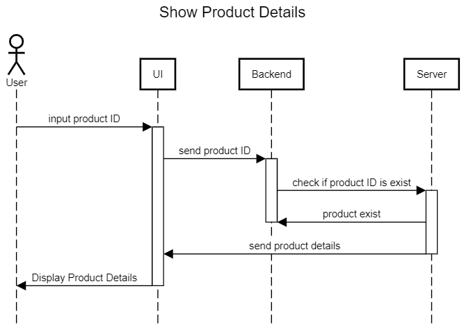
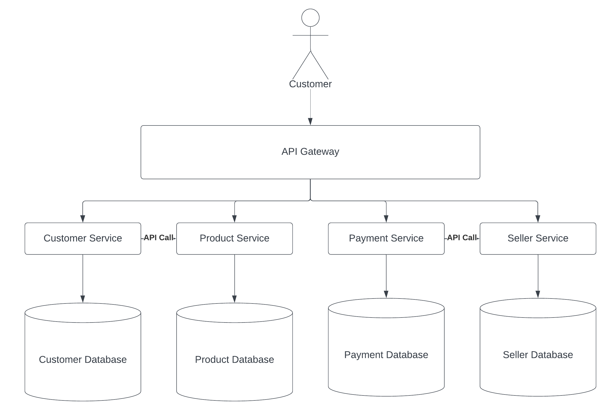

# E-Commerce Design Assignment

## Given Product ID, return Product Details



Menggunakan *Sequence Diagram* dikarenakan untuk merepresentasikan urutan pesan atau pemanggilan antara objek dalam sistem atau proses bisnis. Diagram ini membantu memvisualisasikan alur interaksi antara objek-objek tersebut dan dapat membantu dalam pemodelan dan analisis sistem yang kompleks.

## Create Order



*Microservice Diagram*  digunakan untuk mewakili arsitektur perangkat lunak yang kompleks dengan banyak layanan independen yang saling terhubung. Setiap layanan direpresentasikan sebagai komponen terpisah yang memungkinkan pemisahan tugas-tugas tertentu dalam proses. Hal ini memungkinkan pengembangan dan pengelolaan layanan secara terpisah, meningkatkan fleksibilitas dan skalabilitas sistem secara keseluruhan. Dalam konteks ini, menggunakan diagram mikroserivis dapat membantu untuk memahami dan merancang arsitektur perangkat lunak yang lebih terukur, dapat diandalkan, dan mudah dikembangkan.

Pseudocode:
(asumsi database sudah terurutkan berdasarkan id)
```javascript
//input: customerID (string), [{productID, quantity}] (object)
//output: none

class createOrder():
    constructor(customerID, products):
        this.customerID= customerID
        this.products= products
        this.productDatabase = query product table
        this.customerDatabase = query customer table
        this.orderIDDatabase = query orderID table
        this.paymentDatabase = query payment table
        this.generateOrderID()
        
    getTotalPrice():
        let totalPrice = 0
        
        for each product in this.products.productID:
            totalPrice = totalPrice + this.productDatabase[productID].price
            this.productDatabase[productID].stock -= 1

        return totalPrice

    generateOrderID():
        if this.customerID in this.customerDatabase:
            orderID = max(orderIDDatabase.id) + 1
            if this.checkStock(this.products) == true && this.processPayment(this.getTotalPrice(products)) == true:
                this.callSeller(orderID)
                this.removeStock(this.products)
                return orderID 
        else:
            throw errorMassage

    checkStock():
        for each productID, quantity in this.products.productID, this.products.quantity:
            if productID valid in this.productDatabase && quantity < this.productDatabase.quantity:
                return true

    notifySeller():
       // send this.generateOrderID to seller's email

    removeStock():
        for each productID, quantity in this.products.productsID, this.products.quantity:
            productDatabase[productID] -= quantity

    processPayment():
        if this.getTotalPrice is valid in this.paymentDatabase:
            return true
        else:
            return false
```

|Function's name|Complexity|Analysis|
|---------------|----------|--------|
|getTotalPrice|O(n)|dikarenakan menggunakan n kali *looping* dengan input array of object dengan panjang n. Semakin besar ukuran masukan, semakin lama waktu yang dibutuhkan algoritma untuk menghitung total harga|
|generateOrderID|O(1)|Tidak ada pengulangan code yang dilakukan. Code hanya berjalan secara konstan yaitu 1 kali saja|
|checkStock|O(n)|dikarenakan menggunakan n kali *looping* dengan input array of object dengan panjang n. Semakin besar ukuran masukan, semakin lama waktu yang dibutuhkan algoritma untuk mengecek apakah stok terpenuhi|
|notifySeller|O(1)|Tidak ada pengulangan code yang dilakukan. Code hanya berjalan secara konstan yaitu 1 kali saja. Hanya untuk mengingatkan *seller*|
|removeStock|O(n)|dikarenakan menggunakan n kali *looping* dengan input array of object dengan panjang n. Semakin besar ukuran masukan, semakin lama waktu yang dibutuhkan algoritma untuk mengurangi stock pada database|
|prcessPayment|O(1)|Tidak ada pengulangan code yang dilakukan. Code hanya berjalan secara konstan yaitu 1 kali saja. Hanya untuk me-validasi pembayaran|
