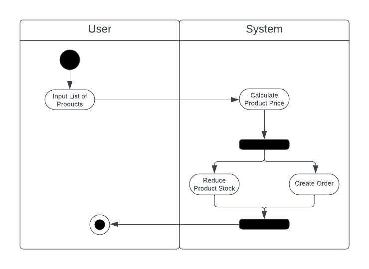

# E-Commerce Design Assignment

## Given Product ID, return Product Details


Menggunakan *Sequence Diagram* dikarenakan untuk merepresentasikan urutan pesan atau pemanggilan antara objek dalam sistem atau proses bisnis. Diagram ini membantu memvisualisasikan alur interaksi antara objek-objek tersebut dan dapat membantu dalam pemodelan dan analisis sistem yang kompleks.

## Create Order



Menggunakan *Activity Diagram* dikarenakan untuk menggambarkan urutan kegiatan atau aktivitas dalam suatu proses bisnis atau teknis yang kompleks. Diagram ini dapat membantu untuk memvisualisasikan bagaimana suatu proses berjalan dan bagaimana aktivitas-aktivitas dalam proses tersebut saling berhubungan dan bergantung satu sama lain.

```
input: array of object (name, price, stock)
output: totalPrice

function createOrder(products):
    let totalPrice = 0
    for each product in products:
        totalPrice = totalPrice + products.price
        products.stock -= 1

    return totalPrice
```

Complexity Analysis: O(n)

*Complexity Analysis* menggunakan O(n) dikarenakan menggunakan n kali *looping* dengan input array of object dengan panjang n. Semakin besar ukuran masukan, semakin lama waktu yang dibutuhkan algoritma untuk menyelesaikan tugasnya